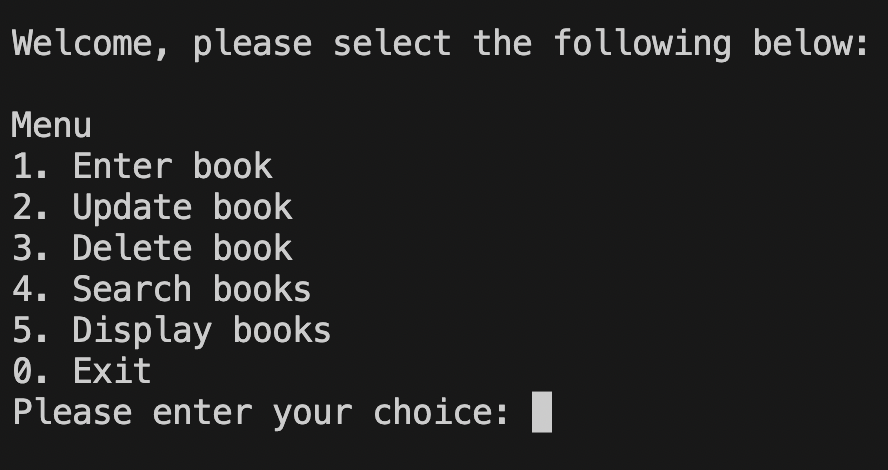
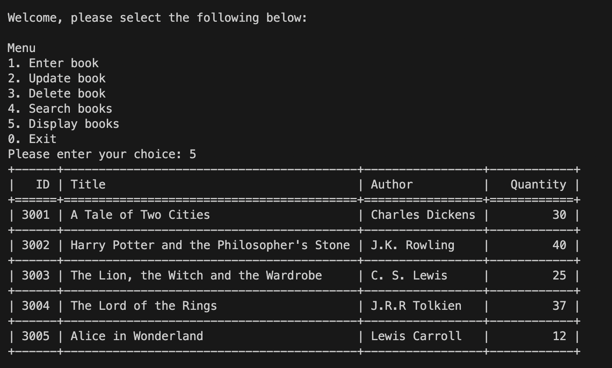

# Capstone Project - Databases

## Description
This project is a Capstone milestone that consolidates the knowledge 
gained and applies it to a real-world situation. The Capstone project 
demonstrates competence in using Python and SQL. The task involves 
creating a program for a bookstore clerk. The program allows the clerk to 
enter data about new books into the database, update book information, 
delete books from the database, and search for the availability of books.

## Table of Contents
- [Introduction](#introduction)
- [Instructions](#instructions)
- [Getting Started](#getting-started)
- [Usage](#usage)
- [Credits](#credits)
- [URL](#url)

## Introduction
Welcome to the Capstone Project - Databases Task! This project is a way to 
test programming skills while creating an application for a bookstore 
clerk. It's an opportunity to apply knowledge in Python and SQL to create 
software that meets specific criteria.

## Instructions
For this project, create a program that allows the clerk to:
- Add new books to the database
- Update book information
- Delete books from the database
- Search the database to find a specific book

Create a database called `ebookstore` and a table called `book` with the 
following structure:

The program should present the user with the following menu:
1. Enter book
2. Update book
3. Delete book
4. Search books
0. Exit

The implementation of these functions is left up to you, but it should 
demonstrate the topics covered in the last module.

## Getting Started
1. Clone this repository.
2. Install the required dependencies.

## Usage
Run the program and choose options from the menu to perform bookstore 
clerk tasks. Follow on-screen instructions.

## Credits
- [Chadley Snippers](#) - Author

## URL
[GitHub 
Repository](https://github.com/ChadleySnippers/Capstone-Project-Databases)

